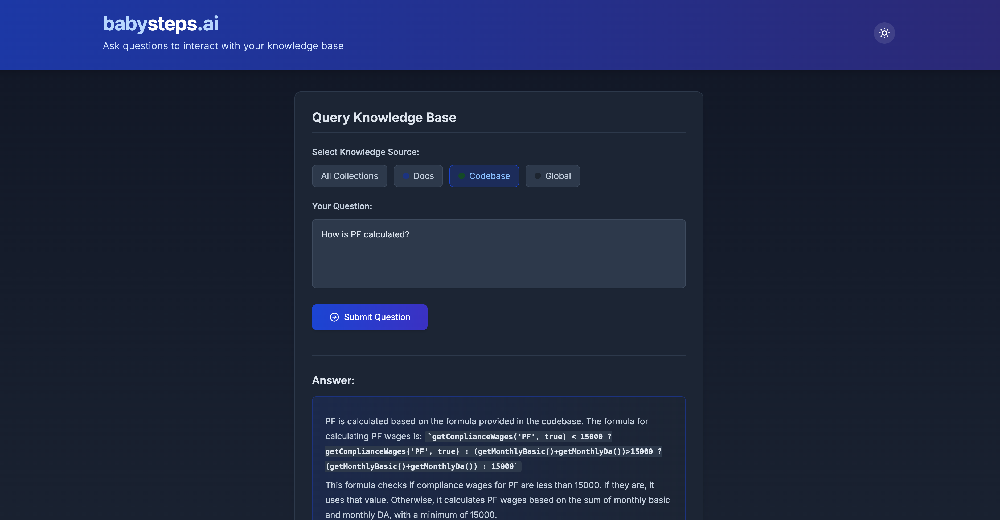
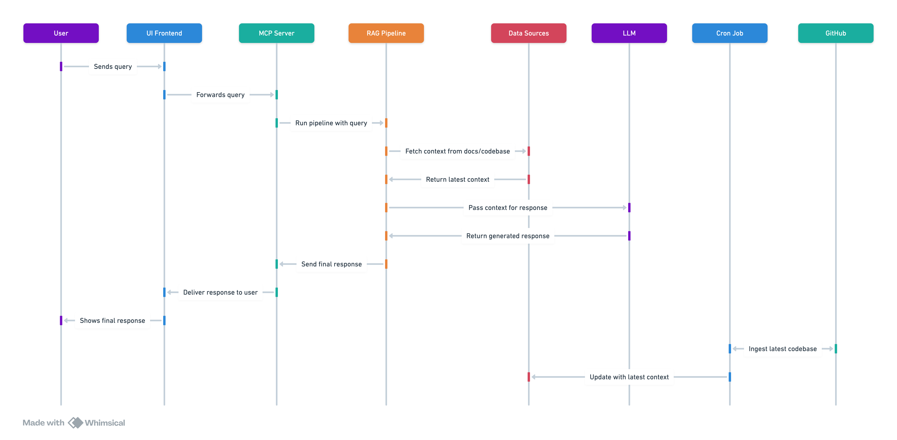

# MCP RAG Application

A RAG (Retrieval-Augmented Generation) application using Qdrant as the vector database and OpenAI as the LLM. This application is designed to ingest and query documents from different collections.

## Features

- Three separate collections: `slack`, `docs`, and `codebase`
- Upload documents to any collection
- Query specific collections or search across all collections
- Fallback to global knowledge when no relevant context is found

## Demo

Here's a screenshot of the working application:



The application provides an intuitive interface for querying your knowledge base across different collections. As shown in the screenshot, users can select specific collections to search from and get detailed responses with source attribution.

## Architecture

The system follows a modern microservices architecture designed for scalability and maintainability:



Key components:
- UI Frontend: React-based user interface
- MCP Server: FastAPI backend server
- RAG Pipeline: Handles document retrieval and context generation
- LLM: OpenAI's GPT model for response generation
- Data Sources: Includes document store and codebase
- Cron Job: Automated updates of the knowledge base
- GitHub: Source code and version control

## Prerequisites

- Python 3.8+
- Node.js 14+
- OpenAI API key
- Qdrant (local or cloud instance)

## Setup

### Backend Setup

1. Install Python dependencies:

```bash
pip install -r requirements.txt
```

2. Create a `.env` file based on `.env.example` and add your OpenAI API key:

```bash
cp .env.example .env
# Edit .env and add your OpenAI API key
```

3. Run the FastAPI backend:

```bash
python app.py
```

The backend server will run on http://localhost:8000.

### Frontend Setup

1. Install Node.js dependencies:

```bash
npm install
```

2. Start the development server:

```bash
npm start
```

The frontend will be available at http://localhost:3000.

## Usage

### Uploading Documents

1. Navigate to the "Upload Documents" tab
2. Select the target collection (slack, docs, or codebase)
3. Either upload a file or paste text directly
4. Click "Upload Document"

### Querying

1. Navigate to the "Query" tab
2. Select a specific collection or leave it as "All Collections"
3. Enter your question in the text area
4. Click "Submit"
5. View the answer and source documents

## Qdrant Setup

If you don't have Qdrant running, you can start it with Docker:

```bash
docker run -p 6333:6333 -p 6334:6334 qdrant/qdrant
```

## License

MIT 